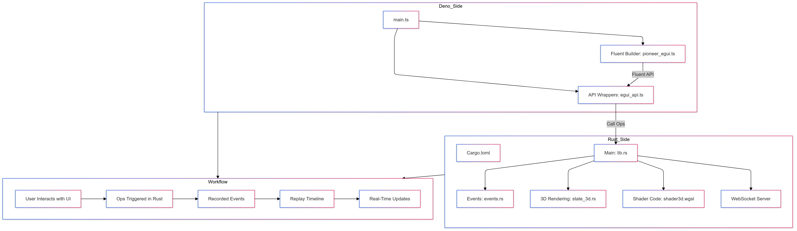

# Pioneer eGUI Timeline Example

 This project demonstrates the
integration of **Deno**, **Rust**, **eGUI**, and **wgpu** into a single
application that supports:

1. **Interactive 3D rendering**
2. **Recording** of user interactions (button clicks, slider changes, 3D object
   rotations, etc.)
3. **Playback** of those recorded interactions on demand

## Prerequisites

- **Rust** (latest stable version)
- **Deno** (latest version)
- A system with **wgpu** support (most modern systems)

## Project Structure

```
pioneer-egui/
├── Cargo.toml
├── src
│   ├── events.rs
│   ├── lib.rs
│   ├── shader3d.wgsl
│   └── state_3d.rs
├── deno
│   ├── main.ts
│   ├── pioneer_egui.ts
│   └── egui_api.ts
└── README.md
```

## Building and Running

1. **Build the Rust side**:
   ```bash
   cargo build --release
   ```

2. **Run the Rust application**:
   ```bash
   cargo run --release
   ```
   This will:
   - Open a window with eGUI controls and 3D rendering
   - Start a WebSocket server on `ws://127.0.0.1:9001`

3. **In another terminal, run the Deno side**:
   ```bash
   cd deno
   deno run --unstable --allow-all --v8-flags="--allow-natives-syntax" main.ts
   ```

## Features

- **3D Rendering**: A rotating cube rendered with wgpu
- **UI Controls**: Various eGUI controls (buttons, sliders, checkboxes, etc.)
- **Recording**: Record all user interactions with timestamps
- **Playback**: Replay recorded interactions in real-time
- **Save/Load**: Save recordings to file and load them back

## Usage

1. Click **Start Recording** to begin recording interactions
2. Interact with the UI (move sliders, click buttons, etc.)
3. Click **Stop Recording** to end recording
4. Click **Start Playback** to replay the recorded interactions
5. Use **Save/Load** to persist recordings to disk

## Architecture

- **Rust Side**:
  - Handles window management with `winit`
  - Renders 3D content with `wgpu`
  - Manages UI with `egui`
  - Exposes ops to Deno via `deno_core`

- **Deno Side**:
  - Provides a fluent builder API for UI construction
  - Manages recording and playback state
  - Communicates with Rust via ops and WebSocket

## Contributing

Feel free to submit issues and pull requests!
